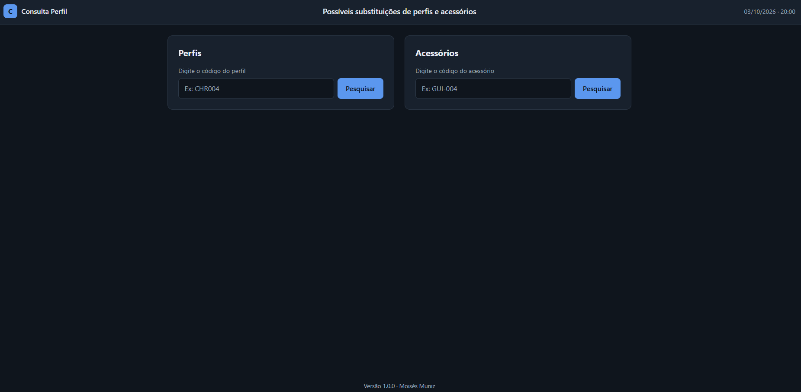

# Consulta Perfil

Site para consultar substituições de perfis de alumínio, acessórios e componentes da [Perfil Alumínio do Brasil](https://perfilaluminio.com.br). Você digita o código e ele mostra na hora por qual código dá para trocar.

**Acesse o site:** [Consulta Perfil](https://munizmoises.github.io/consulta-perfil/)



## Por que eu fiz?

Trabalho com vendas na Perfil Alumínio do Brasil e lido todo dia com perfis de alumínio. São muitos itens e muitos códigos, e ninguém consegue lembrar tudo de cabeça. Quando um perfil não está disponível, era preciso procurar num bloco de notas qual outro serviria no lugar.

Eu já tinha montado uma planilha de Excel para isso com PROCX, e ela ajudou bastante. O problema é que, com vários usuários na mesma planilha online, todo mundo acabava mexendo nas mesmas células ao mesmo tempo.

Então peguei essa ideia e transformei em um site: cada pessoa consulta no seu computador, sem editar nada e sem atrapalhar ninguém.

## O que ele faz?

O site tem duas colunas de pesquisa:

- **Perfis:** para perfis de alumínio.
- **Acessórios:** para acessórios e componentes. Eles têm diferenças entre si, mas deixei os dois juntos na mesma consulta para ficar simples.

Ao pesquisar um código, o resultado mostra:

**Perfis**
- **Substituição:** o código que pode ser usado no lugar
- **Nome:** o nome do perfil
- **Observação:** detalhes importantes, como acabamento ou cor
- **Sistema:** a linha de perfis a que o item pertence
- **Imagem:** foto do perfil original e do substituto

**Acessórios**
- **Substituição:** o código que pode ser usado no lugar
- **Nome:** o nome do acessório
- **Observação:** detalhes importantes
- **Tipo** e **Unidade de conversão:** só aparecem quando o item tem essas informações

A pesquisa ignora hífen e maiúsculas/minúsculas, então `GUI-004`, `gui004` e `GUI004` encontram o mesmo item.

Exemplo de perfil:

```text
Código: CHR004

Substituição: CHR120
Nome:         Complemento do Trilho
Observação:   Janela de Correr 2 Folhas | A cor somente em FOSCO (FO23)
Sistema:      Chroma
```

Exemplo de acessório:

```text
Código: GUI-004

Substituição: -
Nome:         Guia Deslizante 21 mm
Observação:   Guia Deslizante Vedação
Tipo:         PACOTE (PAC)
Und. conv.:   8 PEÇAS
```

O uso na empresa é no computador, mas o layout é responsivo e se ajusta a telas menores, como a do celular. A data e a hora ficam no topo da tela.

## Como foi feito

Escolhi começar simples, sem banco de dados e sem servidor:

- HTML, CSS e JavaScript puro
- Um arquivo JSON (`banco.json`) com todos os itens
- Hospedagem gratuita no GitHub Pages

Quando a página abre, o JavaScript carrega o `banco.json` e procura o código digitado. Não precisa de mais nada para funcionar.

## Tecnologias

**Atual**
- HTML
- CSS
- JavaScript

**Futuro**
- Bootstrap
- Python
- Flask

## Estrutura

```text
consulta-perfil/
├── index.html
├── style.css
├── script.js
├── banco.json
├── assets/
│   ├── fonts/
│   ├── img/
│   │   ├── fotos/
│   │   │   ├── PERFIL/
│   │   │   ├── ACESSORIOS/
│   │   │   └── NO-PHOTO.webp
│   │   └── prints/
└── README.md
└── CHANGELOG.md
```

## Como atualizar os dados

Tudo fica no `banco.json`, separado em `perfis` e `acessorios`. Perfis seguem este formato:

```json
{
  "codigo": "CHR004",
  "substituicao": "CHR120",
  "nome": "Complemento do Trilho",
  "observacao": "Janela de Correr 2 Folhas | A cor somente em FOSCO (FO23)",
  "sistema": "Chroma",
  "imagem": "assets/img/fotos/perfis/chroma/original/CHR004.webp",
  "imagem_sub": "assets/img/fotos/perfis/chroma/substituto/CHR120.webp"
}
```

Acessórios não têm sistema nem imagem (no momento):

```json
{
  "codigo": "GUI-004",
  "substituicao": "-",
  "nome": "Guia Deslizante 21 mm",
  "observacao": "Guia Deslizante Vedação",
  "tipo": "PACOTE (PAC)",
  "unidade_conversao": "8 PEÇAS"
}
```

## Versão Atual

**v1.3.0** — 08/10/2026

### Planejado

**Fase 1 — Essenciais**
- [ ] Autocomplete com sugestões ao digitar
- [ ] Copiar resultado formatado com 1 clique
- [ ] Busca automática ao preencher o código exato
- [x] Botões de pesquisar e limpar

**Fase 2 — Refinamento & UI**
- [x] Campo inteligente que ignora maiúsculas, espaços e hífens
- [ ] Alternância para Modo Claro
- [ ] Tags visuais no card (badges coloridos por sistema, acabamento, etc.)

**Fase 3 — Persistência Local**
- [x] Histórico das 5 últimas pesquisas
- [ ] Contador total de consultas realizadas
- [ ] Lista de favoritos com estrela
- [ ] Top consultas (ranking dos mais pesquisados)

**Fase 4 — Compartilhamento**
- [ ] Link compartilhável (ex: `?codigo=CHR120`)
- [ ] Exportação de relatório em texto e PDF
- [ ] Painel de status (total de perfis, acessórios, data de atualização e versão)

**Fase 5 — Futuro**
- [ ] Login por matrícula
- [ ] Backend com Python e Flask
- [ ] Portal administrativo

> Histórico completo no [CHANGELOG](CHANGELOG.md).

## Autor

**Moisés Muniz**

Estudante de Ciência da Computação. Veja meus outros projetos no [portfólio](https://munizmoises.github.io/portfolio/).